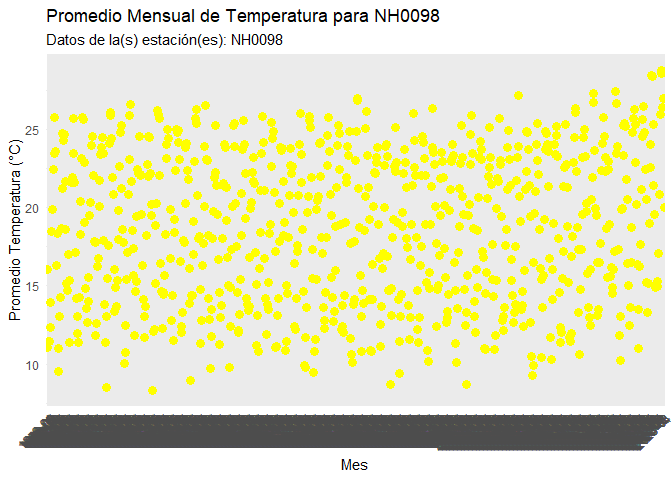

<!-- README.md is generated from README.Rmd. Please edit that file -->

# meteorodata

<!-- badges: start -->

[](https://lifecycle.r-lib.org/articles/stages.html#experimental)
<!-- badges: end -->

El objetivo del paquete ‘meteorodata’ es facilitar el análisis de datos
meteorológicos y la manipulación de los mismos mediante funciones
implementadas en este paquete.

## Instalación

You can install the development version of meteorodata from
[GitHub](https://github.com/) with:

``` r
# install.packages("pak")
pak::pak("MatiFasolato/meteorodata")
```

## Ejemplo

Este es un ejemplo básico que muestra cómo instalar la librería del
paquete:

``` r
library(meteorodata)
library(lubridate)
#> 
#> Adjuntando el paquete: 'lubridate'
#> The following objects are masked from 'package:base':
#> 
#>     date, intersect, setdiff, union

F_to_C(100)
#> [1] 37.77778

estacion_met <- descargar_datos("NH0098", "data_raw/NH0098.csv")
#> Lectura del archivo de estación 'NH0098'
head(estacion_met,5)
#>       id      fecha temperatura_abrigo_150cm temperatura_abrigo_150cm_maxima
#> 1 NH0098 1956-04-01                    13.65                            21.6
#> 2 NH0098 1956-04-02                    16.75                            23.6
#> 3 NH0098 1956-04-03                    19.00                            25.9
#> 4 NH0098 1956-04-04                    17.55                            23.6
#> 5 NH0098 1956-04-05                    20.00                            27.2
#>   temperatura_abrigo_150cm_minima temperatura_intemperie_5cm_minima
#> 1                             5.7                               4.1
#> 2                             9.9                               8.4
#> 3                            12.1                              10.8
#> 4                            11.5                              10.5
#> 5                            12.8                              11.1
#>   temperatura_intemperie_50cm_minima temperatura_suelo_5cm_media
#> 1                                 NA                          NA
#> 2                                 NA                          NA
#> 3                                 NA                          NA
#> 4                                 NA                          NA
#> 5                                 NA                          NA
#>   temperatura_suelo_10cm_media temperatura_inte_5cm
#> 1                           NA                   NA
#> 2                           NA                   NA
#> 3                           NA                   NA
#> 4                           NA                   NA
#> 5                           NA                   NA
#>   temperatura_intemperie_150cm_minima humedad_suelo precipitacion_pluviometrica
#> 1                                  NA            NA                           0
#> 2                                  NA            NA                           0
#> 3                                  NA            NA                           0
#> 4                                  NA            NA                           0
#> 5                                  NA            NA                           0
#>   granizo nieve heliofania_efectiva heliofania_relativa tesion_vapor_media
#> 1       0     0                  NA                  NA                8.3
#> 2       0     0                  NA                  NA               10.4
#> 3       0     0                  NA                  NA               13.2
#> 4       0     0                  NA                  NA               10.6
#> 5       0     0                  NA                  NA               11.6
#>   humedad_media humedad_media_8_14_20 rocio_medio duracion_follaje_mojado
#> 1            NA                    62         4.3                      NA
#> 2            NA                    71         7.5                      NA
#> 3            NA                    78        11.1                      NA
#> 4            NA                    70         7.8                      NA
#> 5            NA                    66         9.2                      NA
#>   velocidad_viento_200cm_media direccion_viento_200cm
#> 1                          3.2                     NA
#> 2                         10.4                     NA
#> 3                          7.2                     NA
#> 4                          7.2                     NA
#> 5                          5.6                     NA
#>   velocidad_viento_1000cm_media direccion_viento_1000cm velocidad_viento_maxima
#> 1                             4                                              NA
#> 2                            13                                              NA
#> 3                             9                                              NA
#> 4                             9                                              NA
#> 5                             7                                              NA
#>   presion_media radiacion_global radiacion_neta evaporacion_tanque
#> 1            NA               NA             NA                 NA
#> 2            NA               NA             NA                 NA
#> 3            NA               NA             NA                 NA
#> 4            NA               NA             NA                 NA
#> 5            NA               NA             NA                 NA
#>   evapotranspiracion_potencial profundidad_napa horas_frio unidad_frio
#> 1                           NA               NA   1.962264          NA
#> 2                           NA               NA   0.000000          NA
#> 3                           NA               NA   0.000000          NA
#> 4                           NA               NA   0.000000          NA
#> 5                           NA               NA   0.000000          NA

C_to_F(23)
#> [1] 73.4

grafico <- grafico_temperatura_mensual(
  read.csv("data_raw/NH0098.csv"),
  colores = c("blue", "yellow"),
  titulo = "Promedio Mensual de Temperatura para NH0098"
)
#> 
#> Adjuntando el paquete: 'dplyr'
#> The following objects are masked from 'package:stats':
#> 
#>     filter, lag
#> The following objects are masked from 'package:base':
#> 
#>     intersect, setdiff, setequal, union
grafico
#> Warning: Removed 3 rows containing missing values or values outside the scale range
#> (`geom_line()`).
#> `geom_line()`: Each group consists of only one observation.
#> ℹ Do you need to adjust the group aesthetic?
#> Warning: Removed 3 rows containing missing values or values outside the scale range
#> (`geom_point()`).
```



``` r

tabla_resumen_temperatura(NH_unidos,c('NH0910','NH0437'))
#> # A tibble: 2 × 9
#>   id     observaciones_temperatura proporcion_NA temperatura_minima
#>   <chr>                      <int>         <dbl>              <dbl>
#> 1 NH0437                     18738       0.0101                 2.1
#> 2 NH0910                     15506       0.00302                0  
#> # ℹ 5 more variables: temperatura_maxima <dbl>, temperatura_promedio <dbl>,
#> #   desviacion_estandar <dbl>, promedio_anual_temperatura <dbl>,
#> #   precipitacion_acumulada_mensual <dbl>
```
